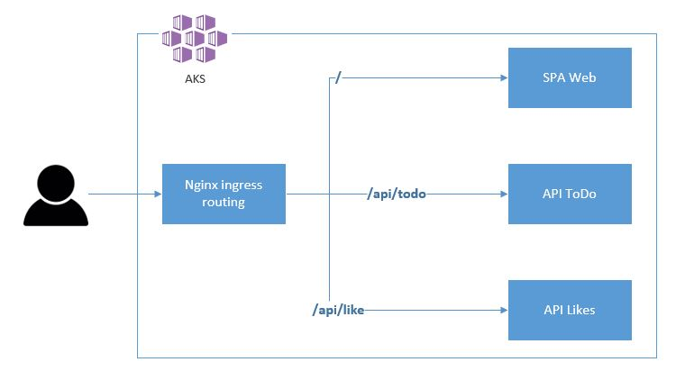
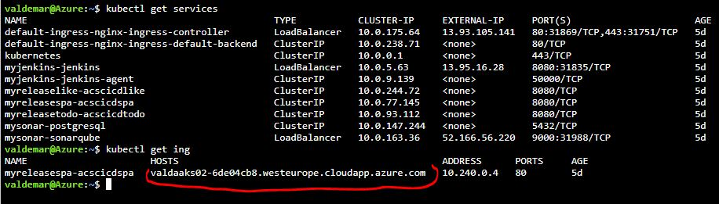

# DEVOPS in AKS - JAVA (Spring boot), Kubernetes (AKS), jenkins, SonarQube, PostgreSQL, ACR, helm

This demo contains simple one page web app with REST API backend microservice (dockerized JAVA Spring Boot application) and Azure PostgreSQL DB for data persistence.
Whole solutions run in kubernetes cluster (Azure Kubernetes Services), CI/CD pipeline also runs in kubernetes cluster and is powered by Jenkins - master node of Jenkins run like separate Pod, all build agents are provisioned on-fly like separate build-agent nodes. SonarQube is used for source code static analyse and for code quality chack.

## Solution architecture



#### Front-end SPA (Single Page Application)
https://github.com/valda-z/acs-cicd-spa - this repository contains single page front end web application hosted in docker image based on spring-boot application.
Application is calling two REST back-end services, URL to backend service is routed to target services in kubernetes cluster by nginx-ingress controller deployed together with this application.

#### REST API ToDo back-end service
https://github.com/valda-z/acs-cicd-todo - this back-end REST API exposes interface for creating, updating and listing ToDo items, data are stored in PostgreSQL database in Azure. This service runs in AKS cluster like internal cluster service and is deployed by helm script.

#### REST API Like back-end service
https://github.com/valda-z/acs-cicd-like - this back-end REST API exposes interface for counting likes, data are stored in PostgreSQL database in Azure. This service runs in AKS cluster like internal cluster service and is deployed by helm script.

## Demonstrated DEVOPS scenario:
* automatically create infrastructure environment AKS (kubernetes), ACR, PostgreSQL).
* deploy nginx-ingerss controller, jenkins and sonarqube to kubernetes cluster
* configured Jenkins with build jobs - Jenkins is able to build Maven project, push docker images to Azure Container Registry and deploy micro-services via helm to kubernetes cluster.
* configure sonarqube - generate access key for jenkins and prepare environment for run.
* PostgreSQL is configured with enabled firewall rules to all IP addresses.
* Kubernetes cluster is preconfigured with secrets for accessing Application Insights (Instrumentation key), JDBC connection string to postgres DB and secrets for communication with ACR (Azure Container Registry).


### Solution can be provisioned by this simple script from Azure Cloud Shell:
* **prerequisites**
 * you need your SSH (private and public) key prepared in cloud shell 
 * public ssh key is in file `~/.ssh/id_rsa.pub`
* run Azure Cloud Shell
* 
* There run install script and provide necessary parameters
* `curl -s https://raw.githubusercontent.com/valda-z/acs-cicd/master/run.sh | bash -s -- --resource-group KUBE --kubernetes-name valdakube --acr-name valdakubeacr --postgresql-name valdakubepostgres --jenkins-password kube123`
* supported parameters are:
 * Mandatory
     * `--resource-group` - Azure resource group name (will be created by script)
     * `--kubernetes-name` - Unique name for kubernetes cluster 
     * `--postgresql-name` - **Unique** name of PostgreSQL instance in Azure 
 * Optional (if not provided than script uses defaults - see script)
     * `--location` - Azure region for resource group and all resources 
     * `--locationpostgres` - Azure region for resource group with postgresql database
     * `--postgresql-user` - Azure region for resource group and all resources 
     * `--postgresql-password` - Azure region for resource group and all resources 
     * `--jenkins-password` - Azure region for resource group and all resources 

### After successful deployment:
* deployment script will show necessary information how to access jenkins, sonarqube and finally our micr-service application

There is sample output:

```
### DONE
### now you can login to JENKINS at http://13.95.16.28:8080 with username: admin , password: kube123
### now you can login to SONARQUBE at http://52.166.56.220:9000 with username: admin , password: admin
### URL for your application is http://valdaaks02-6de04cb8.westeurope.cloudapp.azure.com after deployment

```

* You have to build docker images - from Jenkis management console `http://[YUOR-JENKINS-IP]:8080` you can run build action on tasks `01-SPA`, `02-TODO`, `03-LIKE`
* you can reach your application from web browser on URL: `https://[YOUR-WEBAPP-FQDN]`, public IP address (and FQDN) of your application can be obtained from kubernetes control plane UI or from Azure Cloud Shell by running command `kubectl get services` and `kubectl get ing`


 
#### Possible optimalization
* create special docker image for build with customized build environment
* use persistent volume for maven build agent - it can decrease build time because of persistent artifact of maven (in our case these artifacts have to be loaded each time than build is triggered.


